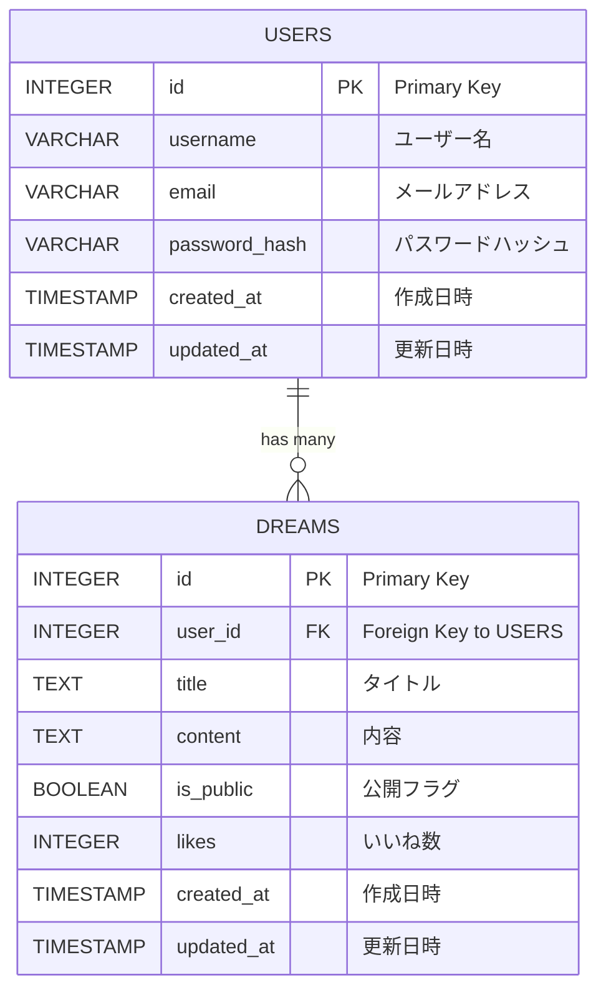

# Dream　Sink

書き溜めた夢を公開して「いいね！」がもらえるWebサービス

## 機能一覧

- 自分の夢
    - [x] 夢の作成
    - [x] 夢の閲覧
    - [ ] 夢の編集
    - [X] 夢の削除
    - [x] 公開 or 非公開設定
- 公開されている夢
    - [x] 夢の閲覧
    - [ ] 夢の絞り込み
    - [x] いいね！

## 画面

WIP

## 技術スタック

| カテゴリ       | 技術                                        | 
| -------------- | ------------------------------------------- | 
| フロントエンド | React, React Router, Tailwind CSS, Radix UI, Jotai | 
| バックエンド   | Flask                                       | 
| データベース   | PostgreSQL                                  | 

## ER図

